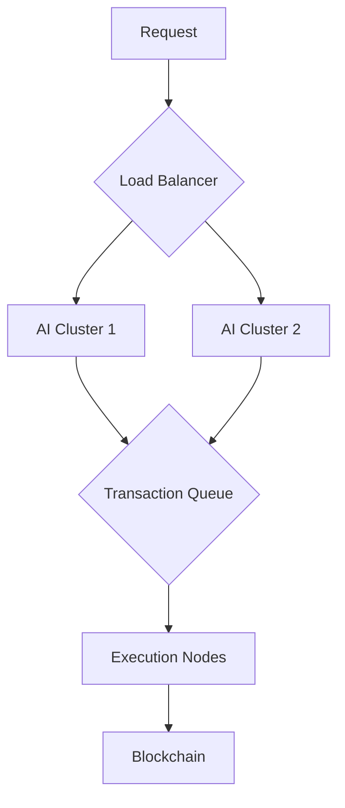

## Overview

Buildr is an AI-powered DeFi agent that enables natural language interactions with blockchain protocols. It translates human instructions into secure, optimized on-chain transactions - making Web3 accessible to everyone.

<Note>
Think of Buildr as your smart blockchain assistant that understands commands like "Launch a token called MOON" and handles all the complex technical steps automatically.
</Note>

## System Architecture

<AccordionGroup>
  <Accordion icon="diagram-project" title="High-Level Flow">
    ```mermaid
    graph LR
      A[User Interface] --> B[AI Layer]
      B --> C[Execution Engine]
      C --> D[Smart Contract Layer]
      D --> E[Blockchain]
      E --> C
      C --> B
      B --> A
    ```

    1. User sends natural language command
    2. AI processes intent and generates execution plan
    3. Engine validates and executes transactions
    4. Smart contracts interact with blockchain
    5. Results flow back to user
  </Accordion>
</AccordionGroup>

## Core Components

### AI Layer

The brain of Buildr, processing natural language into actionable blockchain instructions.

<CardGroup>
  <Card
    title="Intent Detection"
    icon="brain"
  >
    - Natural Language Processing (NLP) models
    - Context-aware command parsing
    - Parameter extraction and validation
    - Multi-step instruction planning
  </Card>
  
  <Card
    title="Safety Checks"
    icon="shield-check"
  >
    - Token contract analysis
    - Transaction simulation
    - Risk assessment
    - Slippage protection
  </Card>
  
  <Card
    title="Optimization"
    icon="gauge-high"
  >
    - Gas price optimization
    - Route optimization for swaps
    - Transaction batching
    - Failure prediction
  </Card>
  
  <Card
    title="Learning System"
    icon="graduation-cap"
  >
    - Pattern recognition
    - User preference learning
    - Command suggestion
    - Continuous improvement
  </Card>
</CardGroup>

### Smart Contract Layer

The blockchain interface handling all on-chain interactions.

<CodeGroup>
```solidity Token Factory
contract BuildrFactory {
    // Deploys new tokens with custom parameters
    function deployToken(
        string name,
        uint256 supply,
        uint8[] taxes,
        bool antiBot
    ) external returns (address);
}
```

```solidity Router
contract BuildrRouter {
    // Handles token swaps across DEXs
    function smartSwap(
        address tokenIn,
        address tokenOut,
        uint256 amount,
        uint256 slippage
    ) external returns (uint256);
}
```

```solidity Vault
contract BuildrVault {
    // Manages user funds and permissions
    function executeTransaction(
        address target,
        bytes memory data,
        uint256 value
    ) external returns (bool);
}
```
</CodeGroup>

### Execution Engine

The orchestrator ensuring reliable and secure transaction execution.

<Steps>
  <Step title="Transaction Preparation">
    - Gas estimation
    - Nonce management
    - Chain state validation
    - Parameter optimization
  </Step>
  
  <Step title="Security Checks">
    - Signature verification
    - Permission validation
    - Balance checks
    - Contract verification
  </Step>
  
  <Step title="Execution">
    - Transaction broadcasting
    - Mempool monitoring
    - Resubmission logic
    - Receipt validation
  </Step>
  
  <Step title="Confirmation">
    - Success verification
    - Event processing
    - State updates
    - User notification
  </Step>
</Steps>

### User Interface Layer

Multiple access points for different user preferences.

<CardGroup>
  <Card
    title="Telegram Bot"
    icon="telegram"
  >
    - Primary interface for commands
    - Secure wallet generation
    - Real-time transaction updates
    - Inline command suggestions
  </Card>
  
  <Card
    title="Web Dashboard"
    icon="browser"
  >
    - Portfolio management
    - Advanced analytics
    - Transaction history
    - Wallet backup & recovery
  </Card>
  
  <Card
    title="X (Twitter)"
    icon="twitter"
  >
    - Social trading integration
    - Market alerts
    - Trending tokens feed
    - Community engagement
  </Card>
  
  <Card
    title="API Access"
    icon="code"
  >
    - REST endpoints
    - WebSocket feeds
    - SDK integration
    - Custom implementations
  </Card>
</CardGroup>

### Wallet System

<Warning>
Your Buildr wallet is automatically generated upon account creation. Keep your recovery phrase safe and never share it.
</Warning>

<AccordionGroup>
  <Accordion icon="key" title="Wallet Generation">
    1. Secure entropy source for key generation
    2. Encrypted storage of private keys
    3. Multi-signature support for high-value accounts
    4. Automated backup system
  </Accordion>
  
  <Accordion icon="shield" title="Security Features">
    - End-to-end encryption
    - Hardware security module integration
    - Biometric authentication support
    - Automated session management
  </Accordion>
  
  <Accordion icon="rotate" title="Recovery Process">
    - 12-word recovery phrase
    - Time-locked recovery options
    - Multi-factor authentication
    - Emergency lockdown features
  </Accordion>
</AccordionGroup>

## Security Model

<Warning>
Security is our top priority. Every component is designed with multiple layers of protection.
</Warning>

### Transaction Security

<AccordionGroup>
  <Accordion icon="lock" title="Authorization Flow">
    1. User signs initial approval
    2. System generates unique session key
    3. Each transaction requires fresh signature
    4. Multi-factor authentication for high-value operations
  </Accordion>
  
  <Accordion icon="shield" title="Contract Safety">
    - Automated contract auditing
    - Honeypot detection
    - Blacklist checking
    - Simulation before execution
  </Accordion>
  
  <Accordion icon="user-lock" title="Access Control">
    - Role-based permissions
    - Transaction limits
    - Whitelisted addresses
    - Time-based restrictions
  </Accordion>
</AccordionGroup>

## Gas & Fees

### Cost Structure

<CardGroup>
  <Card
    title="Gas Optimization"
    icon="gas-pump"
  >
    - Dynamic gas pricing
    - Transaction batching
    - Priority adjustment
    - MEV protection
  </Card>
  
  <Card
    title="Fee Distribution"
    icon="money-bill-transfer"
  >
    - Protocol fees
    - Developer rewards
    - Community treasury
    - Validator incentives
  </Card>
</CardGroup>

## Scalability & Reliability

### System Design

<AccordionGroup>
  <Accordion icon="server" title="Infrastructure">
    - Load balancing
    - Auto-scaling
    - Geographic distribution
    - Redundancy
  </Accordion>
  
  <Accordion icon="arrows-rotate" title="Failover">
    - Multiple RPC endpoints
    - Backup AI models
    - Transaction queuing
    - State recovery
  </Accordion>
</AccordionGroup>

### Performance Optimization



## Future Roadmap

<CardGroup>
  <Card
    title="Chain Expansion"
    icon="link"
  >
    Support for additional EVM chains and L2 solutions
  </Card>
  
  <Card
    title="Advanced AI"
    icon="robot"
  >
    Context-aware agents with transaction memory
  </Card>
  
  <Card
    title="DeFi Integration"
    icon="coins"
  >
    Expanded protocol support and yield strategies
  </Card>
  
  <Card
    title="Social Features"
    icon="users"
  >
    Community governance and social trading
  </Card>
</CardGroup>

<Note>
Our architecture is designed to evolve. We regularly update components based on community feedback and emerging technologies.
</Note>
